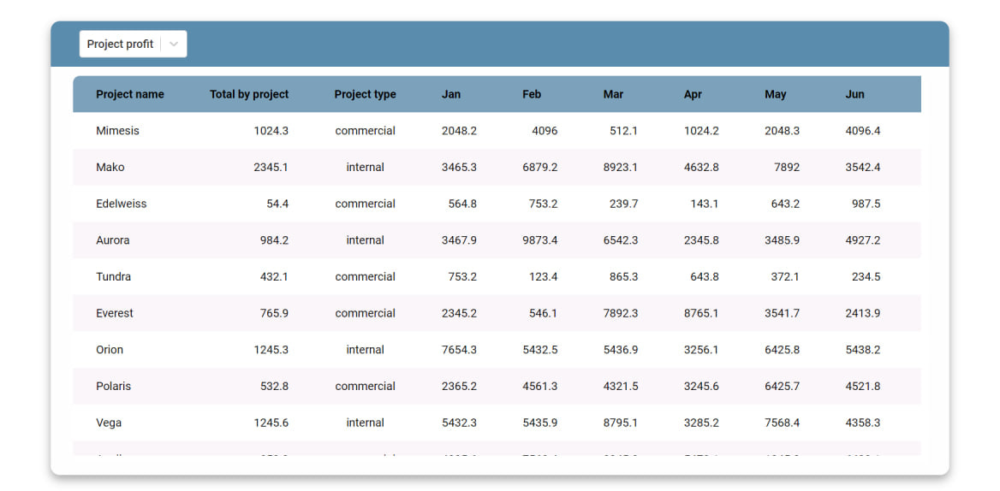

# React project for managing tables using Vite as the development server and JSON Server as the backend. It allows you to select tables.

---

# Getting Started

## Make sure you have Node.js installed on your computer before setting up the project.
---

# Installation

## 1. Clone the repository or download the project files:

> git clone https://github.com/kiselisme/spreadsheet-react.git

>cd spreadsheet-react

## 2. Install project dependencies: 
>npm install

---
# Running the Project

## • To run the project, we use the Vite development server and JSON Server to serve the backend data. You can start both of them simultaneously using the following command: 
>npm start

## This will launch the frontend development server at localhost:3000 and the JSON Server at localhost:3001. The frontend will automatically reload whenever you make changes to the code.

---
# Development and Building

## • To run the Vite development server: 
>npm run client

## • To run the JSON Server: 
>npm run db

## • To lint the code with ESLint: 
>npm run lint

## • To preview a production build locally: 
>npm run preview

---
# Project Structure

# The project is organized as follows:

## • src: Contains the main source code for the React components and application logic.

## • public: Contains the static assets like HTML and CSS files.

## • db.json: Holds the backend data for JSON Server.

---
# Dependencies

## • json-server: A simple JSON-based backend server for prototyping and mocking. 
## • react: A JavaScript library for building user interfaces. 
## • react-dom: Provides DOM-specific methods that can be used at the top level of the application. 
## • react-select: A flexible and customizable replacement for the native element.
---
# Dev Dependencies
## • @types/react: TypeScript types for React.
## • @types/react-dom: TypeScript types for React DOM.
## • @vitejs/plugin-react: A Vite plugin to enable React support.
## • concurrently: Run multiple npm scripts concurrently.
## • eslint: A pluggable and configurable linter tool for identifying and fixing problems in JavaScript code.
## • eslint-plugin-react: React specific linting rules for ESLint.
## •eslint-plugin-react-hooks: ESLint plugin for React Hooks.
## •eslint-plugin-react-refresh: ESLint plugin to support React Refresh.
